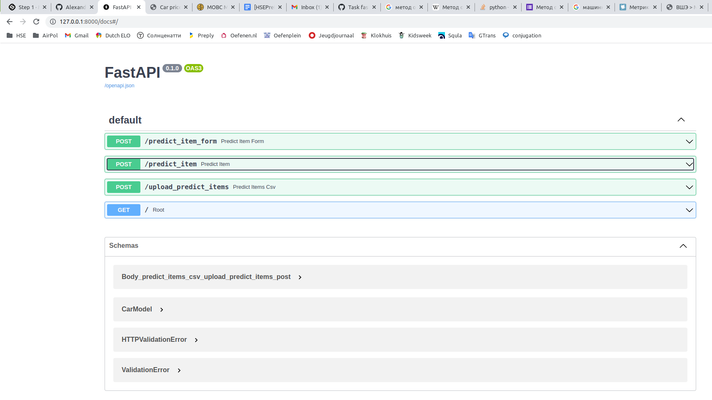
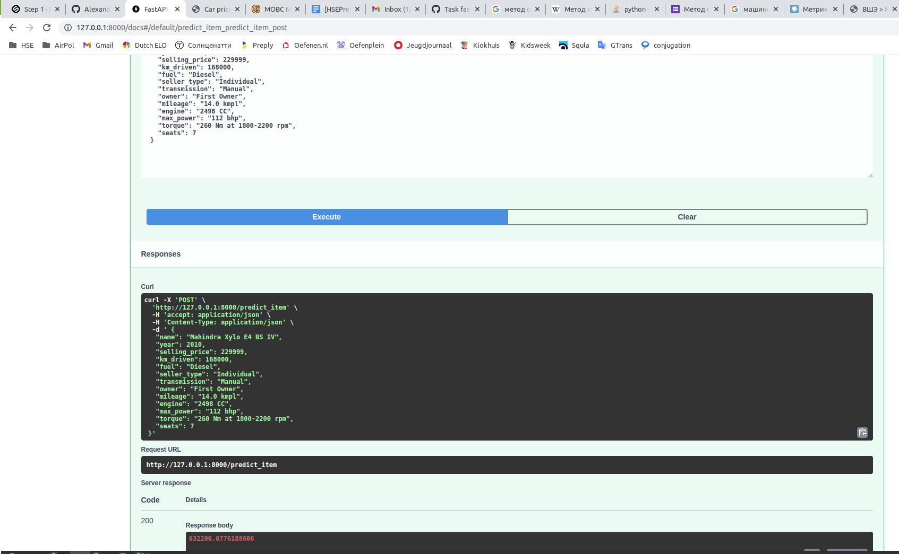
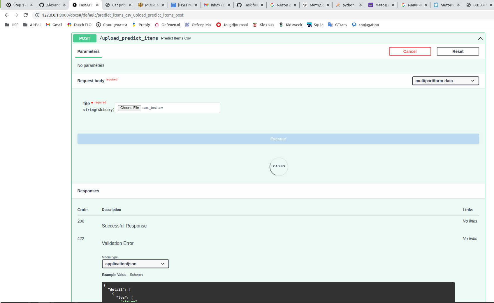
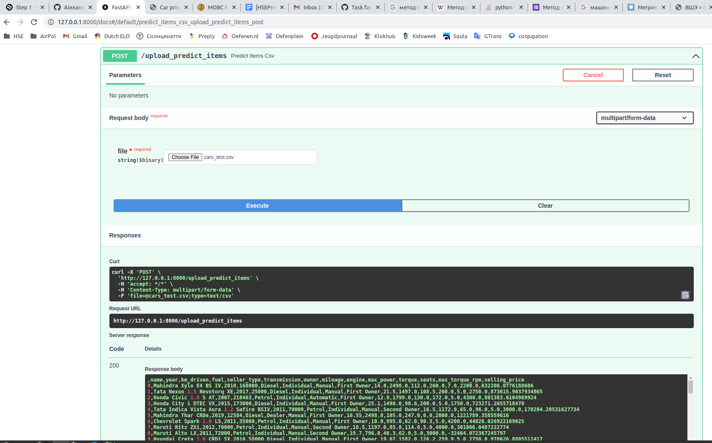
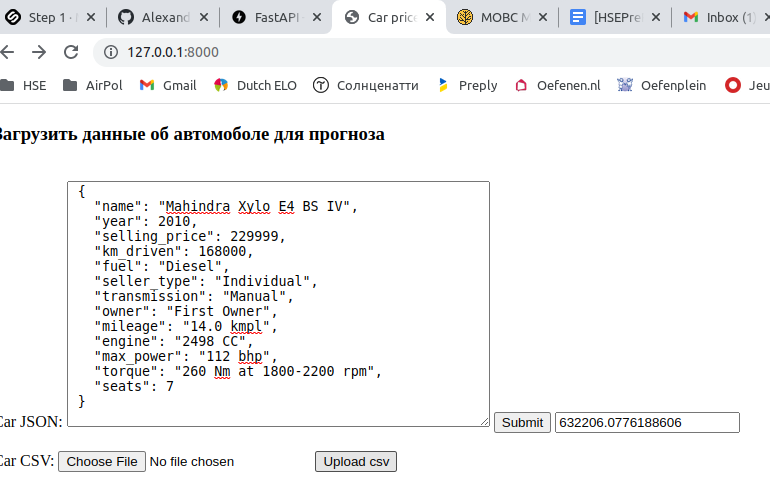
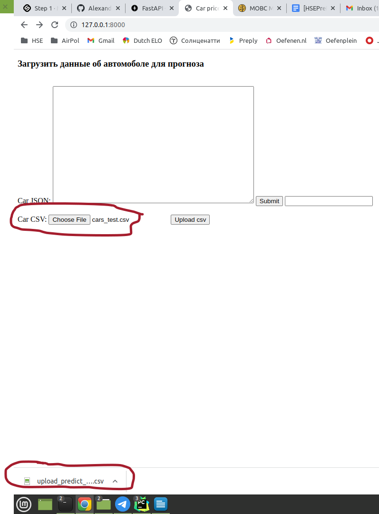

В данном проекте был выполнен анализ датасетов с данными о харакетристиках автомобилей и их ценах.
Был проведен разведочный анализ датасета, который показал следующее:
1. Тренировочный датасет состоит из 6999 строк и 13 столбцов, один из которых - целевая переменная selling_price.
2. В тренировочном датасете встречаются дубликаты по признакам, таких 1159. При этом у них может быть как одна цена, 
так и разные.
3. Есть пропуски в столбцах mileage, engine, max_power, torque, seats. 
4. Столбцы fuel, seller_type, transmission, owner являются категориальными, причем количество уникальных значений в них 
невелико (от 2 до 5), значит к данным столбцам можно будет применить One Hot Encoding.
5. Столбцы year, km_driven являются числовым, а mileage, engine, max_power, torque могут быть приведены к числовым, 
если убрать единицы измерения. Причем в случае в engine, max_power единицы измерения одинаковы, значит их можно отбросить.
В столбце mileage встречаются 2 вида единиц измерения, необходимо преобразование величин к одним единицам измерения.
В столбце torque есть данные для разных величин и диапазонов, причем с разными единицами измерения. Необходимо разделить 
эти величины и преобразовать.
6. Столбец seats является числовым, но его лучше рассматривать как категориальный признак, в первую очередь по тому, что 
он не изменяется непрерывно и некоторые промежуточные значения невозможны. 
7. Анализ графиков и матрицы корреляции столбцов тренировочного датасета показал следующее: 
а) возможно есть линейная зависимость между целевой переменной и признаками torque и max_power, и нелинейная с признаками year
и engine. 
б) Имеется сильная положительная корреляция между признаками max_power (лошадиные силы - л.с.) и engine (объем двигателя) 
(чем мощнее двигатель, тем больше топливный бак), max_power (л.с.) и seats (кол-во мест) (чем больше мест в машине, 
тем мощнее двигатель), max_power (л.с.) и torque (крутящий момент) (чем выше крутящий момент двигателя, тем он мощнее), 
engine (объем двигателя) и seats (кол-во мест) (чем больше мест в машине, тем больше топливный бак), 
engine (объем двигателя) и torque (крутящий момент) (чем выше крутящий момент двигателя, тем больше топливный бак). 
в) Также есть отрицательная корреляция между признаками year и km_driven (пробег) (чем раньше год выпуска тем больше пробег), 
mileage (миль на литр) и engine (объем двигателя) (у автомобилей с большим баком расход топлива выше).
8. Анализ графиков корреляции столбцов тестового датасета показал, что в нем зависимости данных друг от друга похожи.
9. График зависимости цены от года скорее похож на квадратичную зависимость, с осью симметрии в районе 1995 года, 
чем на линейную. Значит имеет смысл заменить значения в столбце год на (год - 1995) в квадрате.
10. Были построены гистограммы распределений значений столбцов. На них видны длинные хвосты выбросов. Также видно, что 
распределение значений engine имеет два пика, у столбца maq_power намного чаще встречаются значения в диапазоне от 70 до 100.
Столбец max_torque похоже имеет не нормальное распределение.
11. box_plot показал, что по всем признакам имеются выбросы. Можно попробовать их убрать.

С датасетом были выполнены следующие действия:
1. Были удалены дубликаты, причем в случае с различной ценой, были оставлены те строки, в которых цена максимальна.
2. В столбцах engine, max_power были удалены единицы измерения, так как они одинаковы. 
3. Значения в столбце torque были разделены на torque и max_torque, единицы измерения torque были преобразованы к Nm. 
После чего все единицы измерения были удалены. 
4. Значения в столбце mileage были преобразованы к kmpl и единица измерения удалены.
5. Были заполнены медианой пропуски в столбцах mileage, engine, max_power, seats, torque, max_torque_rpm.
6. К числовым признакам была применена стандартизация (StandardScaler).
7. Была проведена процедура One Hot Encoding для столбцов fuel, seller_type, transmission.
8. Была проведена процедура Ordinal Encoding для столбцов owner и seats, потому что их значения имеют иерархический порядок.
9. Значения в столбце год были заменены на (год - 1995) в квадрате. Это впоследствии дало улучшение метрики r2.
10. Были предприняты попытки удаления выбросов как по признакам отдельно (3,5% данных попали в выбросы), 
так и по целевой переменной (2,3% данных попали в выбросы). Но последующий анализ метрики r2 показал ухудшение прогноза.

Были протестирована линейная регрессия с регуляризаторами и без:
1. LinearRegression на отдельном датасете с исключительно числовыми признаками до их стандартизации (StandardScaler) дала 
результат метрики r2: 0.6 на train и 0.61 на test.
2. Lasso регрессия с коэффициентом равным единицы, примененная к стандартизированным данным, score не улучшила и 
никакие веса не занулила. Видимо это связано с большим значением целевой переменной и тем, что порядок весов, как 
следствие, это тысячи. 
3. Был выполнен перебор по сетке (c 10-ю фолдами) для Lasso регрессии с помощью модуля LassoCV. Был подобран коэффициент 
7452.71. При этом регуляризация занулила веса при mileage и engine. При это r2 ухудшилась: 0.6 на train и 0.59 на test.
4. Был выполнен перебор по сетке (c 10-ю фолдами) для ElasticNet регрессии с помощью модуля ElasticNetСV.
Были подобраны коэффициенты alpha: 741.85 и ratio: 0.5. При этом score'ы стали совсем плохими: на train 0.01, на test: -0.01.
5. После преобразований категориальные столбцы были объединены с числовыми и была применена Ridge регрессия. Был подобран
коэффициент 10, при этом r2 улучшились: 0.64 и 0.66 на train и test соответсвенно.
6. Все преобразования были собраны в общий pipeline и еще раз выполнен подбор параметров для разных регуляризаций. 
И результаты оказались несколько отличными. Линейная регрессия без регуляризации на датасете со всеми числовыми и 
категориальными признаками до замены года на квадрат года показала самый лучший score: на train 0.6352, на test 0.6709. 
Все регуляризации показывали близкий score при параметрах близких к отсутствию регуляризации. При других параметрах score был хуже.
7. После удаления выбросов по признакам score на train улучшился (0.7157), а на test ухудшился (0.528). Видимо выбросы 
нередки и в test, и вероятно, вообще нередки, значит их нельзя удалять.
8. После удаления выбросов по целевой переменной score на train улучшился незначительно (0.6395), а на test стал совсем 
вообще отрицательным (-7.7602). Значит модель вообще перестала работать, выбросы по цене удалять нельзя.
9. Год был преобразован в (год - 1995) в квадрате. Линейная регрессия показала небольшое улучшение score:
 b на train 0.6486 (с 0.6352), и на test 0.6803 (с 0.6709). Значит, это преобразование является полезным и его стоит
использовать дальше.

Подводя итог, значительного буста в качестве достигнуть не удалось. Но лучшей оказалась следующая предварительная 
обработка данных и модель:
1. Стандартизация (StandardScaler) числовых признаков.
2. One Hot Encoding для столбцов fuel, seller_type, transmission.
3. Ordinal Encoding для столбцов owner и seats.
4. Замена значений в столбце year на (year - 1995) в квадрате.
5. Линейная регрессия без регуляризации.

Было опробовано удаление выбросов отдельно по признакам, отдельно целевой переменной. Результат ухудшился.

По итогам работы был разработат web-сервис, в котором реализовано 2 метода:
1. Метод принимает на вход json строку с признаками для одного объекта, возвращает прогноз цены.
2. Метод принимает на вход csv файл с признаками для некоторого количества объектов. Возвращает csv файл с дополнительной 
колонкой, в которой сохранен прогноз цены по каждому объекту.
3. Для сервиса была сделана главная страница. Пока она без стилей, так что выглядит ужасно, но работает.

Скриншоты сервиса прилагаются ниже.

